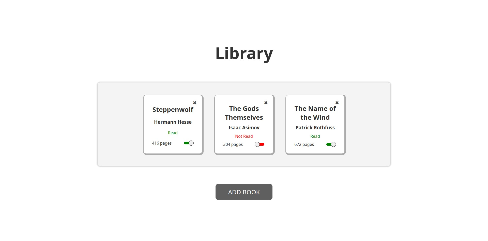

# Library

## The Odin Project
- This is a project done following the course "The Odin Project".
- All the code is original and created from scratch by myself.

## Usage
- This app allows you to have a record of the books you have read and want to read.
